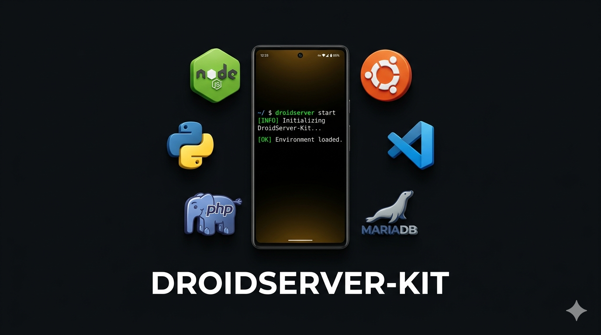

<p align="center">
  
</p>

# 🔥 DroidServer-Kit 

<p align="center">
  
  
  
</p>

**DroidServer-Kit** is an automated, all-in-one full-stack development environment setup script for Android via Termux. It transforms your mobile device into a powerful local server and coding workspace with a single installation menu.

Developed by **Nasim Akhtab**.

---

## 🚀 Features

With a simple interactive CLI menu, you can install:
*   **Core System:** Essential packages (`git`, `curl`, `wget`, `nano`, `tar`).
*   **Programming Languages:** Node.js, Python, npm, yarn, and nodemon.
*   **XAMPP Alternative Stack:** Apache2, MariaDB (MySQL), and PHP for local hosting.
*   **VS Code Server:** Run a fully functional VS Code directly in your mobile browser.
*   **Ubuntu CLI:** A complete Ubuntu Linux environment (via `proot-distro`).
*   **Global Server Manager:** A custom `droidserver` command to easily start, stop, and manage all your background services.

---

## ⚠️ Prerequisites

1.  **Termux App:** Download the latest version of Termux from [F-Droid](https://f-droid.org/packages/com.termux/) (Do NOT use the Play Store version as it is outdated).
2.  **Storage:** Ensure you have at least **3 GB of free internal storage**.
3.  **Permissions:** Allow storage permissions when prompted during installation.

---

## 🛠️ Installation

You can install the entire toolkit using a single command. Open Termux, copy the command below, and paste it:

```bash
curl -sL [https://raw.githubusercontent.com/NasimDev95/DroidServer-kit/main/setup.sh](https://raw.githubusercontent.com/NasimDev95/DroidServer-kit/main/setup.sh) | bash
